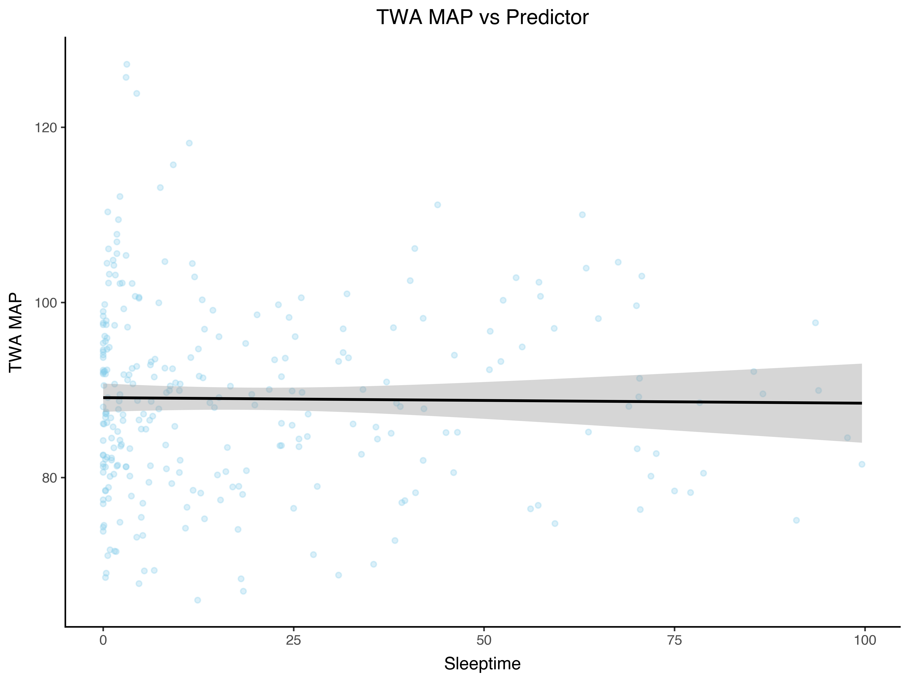
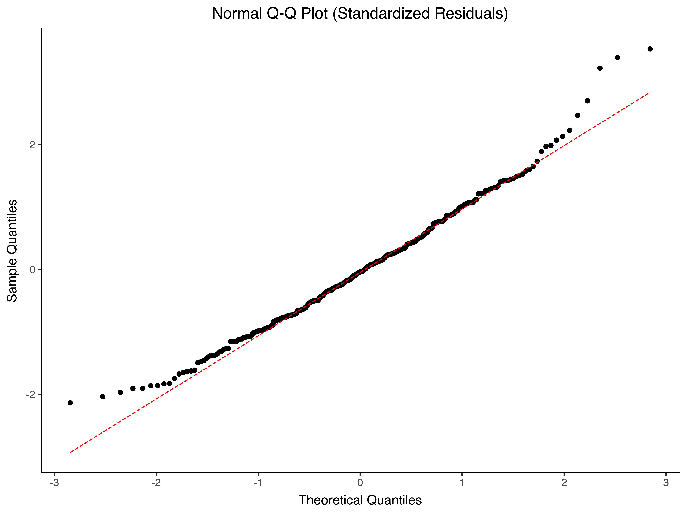
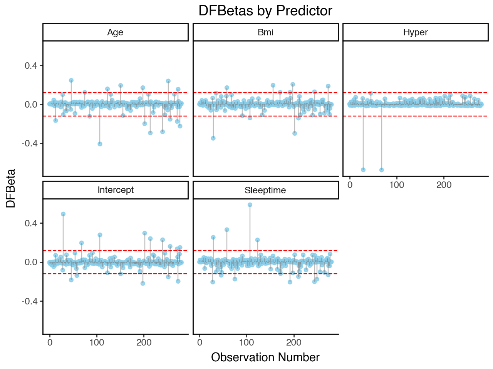
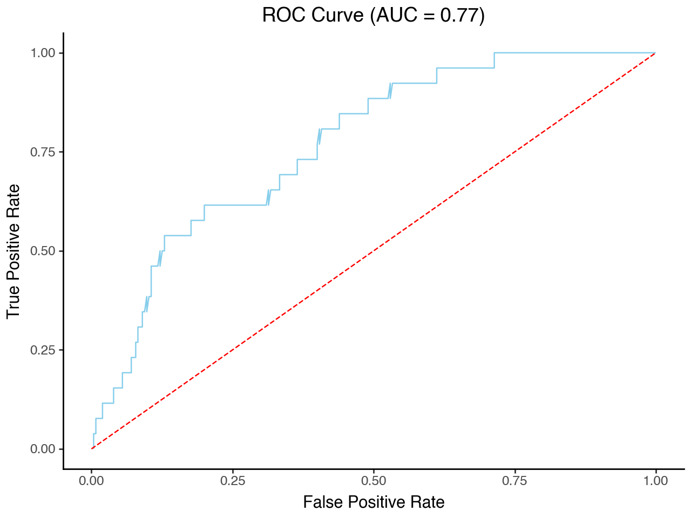

# RegressionMadeEasy

Linear & Logistic Regression Diagnostics Library

# Overview:
We have created a Python library designed to simplify regression diagnostics for both linear and logistic regression models. 
The goal of this project is to take a fitted model object (from statsmodels) and automatically generate standard diagnostic plots used to evaluate model assumptions, detect outliers, and assess overall model quality.
Instead of manually extracting residuals, fitted values, and influence measures, this library provides ready-to-use visualizations that are directly tied to your model and data.

## Input:
Both classes (LinearMadeEasy & LogisticMadeEasy) in this library require a fitted regression model from statsmodel.

The core idea is that each class will accept the fitted model object, extract relevant diagnostic quantities (residuals, fitted values, influence, etc), store them internally, and provide plotting methods as properties for easy access. 

## For LinearMadeEasy, there are 5 properties:

diagnostic_data - Creates a structured dataset containing key diagnostic values and returns fitted values, residuals, and standardized residuals. This serves as the foundation for the other plots which ensures consistency and avoides repeated computation.

resid_vs_fitted - Plots residuals against fitted values testing for linearity asusmption and homoscadasticity. Random scatter is good, patterns or curves can be an indication for possible issues.

qq_plot - Creates a normal QQ-Plot of standardized residuals. This checks the normaility of residuals. Points on the line indicates a normal distribution, and deviations from the line like heavy tails can indicate possible skewness.

regression_plot - Visualizes observed data along with the fitted regression line. This shows the relationship between predictor and response, and how well the model fits the data.

cooks_distance_plot - Identifies influential observations using Cook’s Distance by checking the influence of each data point on the fitted model. Points above the threshhold may strongly influence the model and should be checked.

## For LogisticMadeEasy there are 5 properties:

deviance_residual_vs_fitted_plot - Plots deviance residuals against fitted values to check for outliers and non-linearity in the residual space. Observations with large deviance residuals are cases where the model predicted a high probability but the outcome was 0, or a low probability but the outcome was 1.

cooks_distance_plot - Identifies influential observations using Cook's Distance by checking how much each observation influences the fitted model. Points above the theoretical threshold of 4/sample size (n) may strongly influence the model and should be checked.

dfbetas_plot - Plots DFBetas (standardized change in a coefficient when a single observation is removed) for each predictor including the intercept to show how much each observation influences each individual coefficient. Each predictor is shown in its own panel with threshold lines at +/- 2/sqrt(n).

vif_plot - Plots the Variance Inflation Factor for each predictor to check for multicollinearity. Reference lines are drawn at VIF = 2 and VIF = 5, where larger values indicate stronger multi-collinearity among predictors.

roc_curve_plot - Plots the ROC curve and reports the Area Under the Curve (AUC) in the title to evaluate model discrimination. A diagonal reference line represents a random classifier, and curves further above it indicate better model performance.

# Example Data and Testing:

To demonstrate functionality, we include an example dataset (hypoxia.csv) and testing workflow within the project.
For the linear model the outcome variable is 'TWA MAP' and the predictor variable is 'Sleeptime'. For the logistic model the outcome variable is 'CAD' and the predictors are 'Age', 'BMI', 'Hyper', 'Sleeptime'. 

## Linear Regression
insert teting code here
```python
# Import required libraries
import pandas as pd
import statsmodels.api as sm
from regressionmadeeasy.logisticreg import LinearMadeEasy, LogisticMadeEasy

# Load sample dataset
df = pd.read_csv("tests/data/hypoxia.csv")

y = df["TWA MAP"]
X = sm.add_constant(df[["Sleeptime"]])

# Fit logistic regression model
model = sm.OLS(y, X).fit()

# Create LogisticMadeEasy object
linear_diag = LinearMadeEasy(model)

# Generate diagnostic plots
linear_diag.regression_plot.save("lin_model_regression_plot.png") 
linear_diag.resid_vs_fitted.save("lin_model_residuals_plot.png") 
linear_diag.qq_plot.save("lin_model_qq_plot.png") 
linear_diag.cooks_distance_plot.save("lin_model_cooks_distance_plot.png")

Example Regression Plot:



Example QQ Plot output:



```

## Logistic Regression

Fit a logistic regression model from the same sample data, and generate diagnostic plots.

```python
# Define outcome and predictor variables
y = df["CAD"]
X = sm.add_constant(df[["Age", "BMI", "Hyper", "Sleeptime"]])

# Fit logistic regression model
model = sm.Logit(y, X).fit()

# Create LogisticMadeEasy object
logistic_diag = LogisticMadeEasy(model)

# Generate diagnostic plots
logistic_diag.deviance_residual_vs_fitted_plot().save("log_model_deviance_residuals_plot.png")
logistic_diag.cooks_distance_plot().save("log_model_cooks_distance_plot.png")
logistic_diag.dfbetas_plot().save("log_model_dfbetas_plot.png")
logistic_diag.vif_plot().save("log_model_vif_plot.png")
logistic_diag.roc_curve_plot().save("log_model_roc_curve_plot.png")
```

Example DFBetas Plot:



Example ROC curve output:



```

## Logistic Regression

Fit a logistic regression model from the same sample data, and generate diagnostic plots.

```python
# Define outcome and predictor variables
y = df["CAD"]
X = sm.add_constant(df[["Age", "BMI", "Hyper", "Sleeptime"]])

# Fit logistic regression model
model = sm.Logit(y, X).fit()

# Create LogisticMadeEasy object
logistic_diag = LogisticMadeEasy(model)

# Generate diagnostic plots
logistic_diag.deviance_residual_vs_fitted_plot().save("log_model_deviance_residuals_plot.png")
logistic_diag.cooks_distance_plot().save("log_model_cooks_distance_plot.png")
logistic_diag.dfbetas_plot().save("log_model_dfbetas_plot.png")
logistic_diag.vif_plot().save("log_model_vif_plot.png")
logistic_diag.roc_curve_plot().save("log_model_roc_curve_plot.png")
```

Example DFBetas Plot:


Example ROC curve output:

